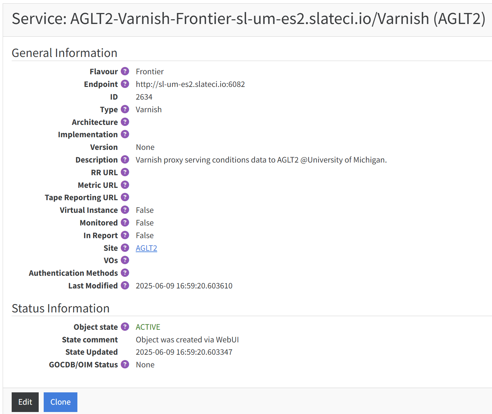

# v4A

Varnish for ATLAS

[](https://github.com/ivukotic/v4A/actions/workflows/DockerPush.yml)

Varnish is a reverse http proxy. It is meant to cache accesses to one application/server. For this purpose it is sufficient to use RAM for caching.
Even a single core and 3 GB of RAM will work well and have a very high cache hit rate, but if you can, optimal would be 4 cores and 32GB RAM. Caching CVMFS accesses will benefit from even more RAM.

We support use of Varnish for Frontier accesses and for CVMFS accesses. We don't want to serve both of them with the same Varnish instance. Varnish for Frontier should be listening on port 6082 and Varnish for CVMFS should listen on port 6081.

## Setting it up

### On a K8s cluster

This is the easiest way to set it up. Simply download [this](kube/k8s_deployment.yaml) yaml file, change the two values \<SITENAME\> and \<NODE\> and do:

```bash
kubectl create ns varnish
kubectl create -f k8s_deployment.yaml
```

This will create appropriate configuration config map and deployment.

### On an OpenShift cluster

This is the easiest way to set it up. Simply download [this](kube/open_shift_deployment.yaml) yaml file, change the two values \<SITENAME\> and \<NODE\> and do:

```bash
kubectl create ns varnish
kubectl create -f open_shift_deployment.yaml
```

This will create appropriate configuration config map, deployment and service.

### In Docker

Simply go to docker directory and edit [docker-compose file](docker/docker-compose.yaml), change the two values \<SITENAME\> and \<NODE\> and do:

```bash
docker compose start
```

### On an VM, bare metal

Any version you pick will work fine since we need only the basic functionality. Instructions on how to install it are [here](https://varnish-cache.org/docs/trunk/installation/index.html).
To start it you run this command

```bash
varnishd -a :6081 -f /path/to/your.vcl -s malloc,6G
```

here:

* -a :6081: This binds Varnish to listen on port 6081.
* -f /path/to/your.vcl: Specifies the VCL file (your.vcl) to use. Replace /path/to/your.vcl with the actual path to your VCL file.
* -s malloc,6G: Configures the cache storage to use memory (malloc) and allocates 6GB of RAM for caching.

## Configuring it for Frontier access caching

This is a [configuration](default.vcl) that you will need. It is very simple and it just loads cache misses from the two ATLAS Frontier servers.
If it works correctly command like this should return 200:

```bash
curl -L -o /dev/null -s -w "%{http_code}" -H "Cache-Control: max-age=0" http://<HOSTNAME>:6082/atlr
```

## Configuring it for CVMFS traffic caching

This is a [configuration](default_cvmfs.vcl) that you will need. It defines 4 backends (Fermilab, two at BNL, and CERN). This configuration is optimal for MWT2 and AGLT2, sites on US East coast would probably want to swap order of Fermilab and BNL. If the repo can't be found at the first backend, it will try the next one. If none of them have the file, request will fail.

to test it do:

```sh
setupATLAS
asetup 20.20.6.3,here
export FRONTIER_SERVER=(serverurl=http://v4a.atlas-ml.org:6081/atlr)
db-fnget
```

## CRIC settings

Only Varnish servers that serve Frontier should be mentioned in [CRIC](https://atlas-cric.cern.ch/).
They are a CRIC Service, so you should click here to create a new one.


There are only a few fields you should fill:

| **Parameter**  | **Value**        |
| -------------- | ---------------- |
| Site           | \<SITENAME\>       |
| Service Type   | Squid            |
| Object State   | Active           |
| Endpoint       | \<ADDRESS:PORT\>   |
| Flavour        | Frontier         |



To add the created service to your site and change order of priority of caching services, first find your site [here](https://atlas-cric.cern.ch/core/experimentsite/list/). Looking at details you will see something like this:


Clicking "Manage configuration" will allow to add/remove a caching proxy and reoder them. Feel free to add a varnish from a nearby site as a backup with the lowest priority.

## Monitoring

This [dashboard](https://atlas-kibana.mwt2.org:5601/s/varnish/app/r/s/gol0t) gives most important data: requests rate, cached hit and miss rates, amount of data delivered and uptime.

## Instances

### NRP

configurations are in <https://github.com/maniaclab/NRP>.

| **Kind** | **Instance** | **Address** | **Node selector** |
| --------- | --- | --------------- | ------------- |
|   Frontier |  Starlight-1f  |  <http://starlight.varnish.atlas-ml.org:6082>  | dtn108.sl.startap.net |
|   Frontier |  frontier-01   |  <http://sl-um-es2.slateci.io:6082>  | sl-um-es2.slateci.io  |
|   Frontier |  NET2-2f | <http://storage-01.nrp.mghpcc.org:6082>  | storage-01.nrp.mghpcc.org |
|   CVMFS | Starlight-1 | <http://starlight.varnish.atlas-ml.org:6081> | dtn108.sl.startap.net |
|   CVMFS | aglt2-1 | <http://sl-um-es3.slateci.io:6081> | sl-um-es3.slateci.io |
|   CVMFS | msu-1 | <http://msu-nrp.aglt2.org:6081> | msu-nrp.aglt2.org |
|   CVMFS | net2-1 | <http://storage-01.nrp.mghpcc.org:6081> | storage-01.nrp.mghpcc.org |

### UC AF

configurations are in <https://github.com/maniaclab/flux_apps>.

| **Instance** | **Address** | **Host** | **Node Label** |
| ------------ | --------------- | ---- | ------ |
|  cvmfs-uc          | <http://v4cvmfs.mwt2.org:6081> | c034.af.uchicago.edu | cvmfs-slate |
|  frontier-uc-01    | <http://v4a.mwt2.org:6081> | c035.af.uchicago.edu | frontier-slate  |

### Roma

| **Instance** | **Address** | **Use** |
| ------------ | --------------- | ---- |
|  v4f-1         | cmsrm-svc-02.roma1.infn.it:6082 | local use |
|  v4f-2   | cmsrm-svc-01.roma1.infn.it:6082 | CloudFlare  **eu-central** |

### ES

| **Instance** | **Address** | **Use** |
| ------------ | --------------- | ---- |
|  frontier-01 | varnish.pic.es:6082 | CloudFlare **v4f-es** |

## CloudFlare

We have two CloudFlare DNS loadbalancers. One for Frontier and one for CVMFS.
Important Frontier Varnish instances are reachable at <http://v4a.hl.lhc.net:6082>. Health checks in CF are trying to access "/atlr" directory once per minute.
All CVMFS Varnish instances are reachable at <http://varnish.hl-lhc.net:6081>.
Health is checked by trying to access: /cvmfs/atlas.cern.ch/.cvmfspublished

## Stress testing

direct to origin:

curl '<http://atlasfrontier1-ai.cern.ch:8000/atlr/Frontier/type=frontier_request:1:DEFAULT&encoding=BLOBzip5&p1=eNp1k8FuwyAMhl8FcZ6mKrcddvDANEgOIPC67cT7v0VpEwpJ2A1-32-LKCQhoWLhvMZstYAk5HaWbysNENFx7yqpCQcLNvuoqjHfRAF4braSmtCYVLSBrXct1MGas4kQTLffs642qRkXyDeMaTdoz1.zXGLbr7yB4gkSL15nDbz6HhRvPGmMdaB112foRFsywB950Cmg6qMdPmXLOmQdDuKbOXfgL0c0o47VtA41g3NIx306fMoOpu9N67D.xvBF.HoRA97SDNdhuue72dN-HUd3usOw6.ikMNEvQgKXr56V9.QNZbaE8l2WY5gul-x4MEmKY-0zY8T6G32K6eMOZZPoOQ>__' -H "X-frontier-id: varnish" -X GET

through Squid:
export http_proxy=<http://uct2-slate.mwt2.org:32200>

siege:
siege -c30 --reps=once  --header='X-frontier-id:siege' -f requests_frontier_origin.txt > /dev/null &  

through Varnish:
curl -X GET <http://v4a.mwt2.org:6081/atlr/Frontier/type=frontier_request:1:DEFAULT&encoding=BLOBzip5&p1=eNpdj0EKAjEMRa8SshYZxa2L0Ga02GmGJiKucv9bWLEzFHfvv3wSopw5GBSJ7CkCKWBnPIDRbZM-7K7Qwrv9hu6zhIerkT11Hw.utyJrqGm1JGVvDa619K2eilrqZ4aMMFdZAMkyqQeRLHP2GBSP2Gg9T5O3hYrwF193rrz9eYXT5QOWkUJt>
